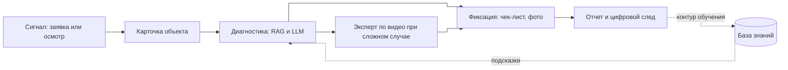

# 01. Описание системы

## Назначение

`RMA` (`Railway Maintenance Assistant`) - система интеллектуальной поддержки технического обслуживания объектов ВСМ (высокоскоростных магистралей). Система помогает полевому специалисту быстро определить объект, получить связанную с ним документацию и историю, понять возможную причину неисправности с помощью ИИ-подсказок по базе знаний, выполнить чек-лист, зафиксировать результат осмотра и сформировать отчет. Сложные случаи специалист эскалирует эксперту по видеосвязи, а каждый разобранный случай пополняет базу знаний.

Главная проблема: обслуживание объектов ВСМ связано с большим объемом разрозненных технических данных - паспорта оборудования, инструкции, регламенты, история неисправностей, результаты работ. На практике специалист тратит время на поиск нужной инструкции, диагностика зависит от его личного опыта, а фиксация работ ведется вручную и в разном формате. RMA связывает объект, документацию, историю, описание неисправности и результат работ в одном процессе и накапливает единый цифровой след обслуживания.

## Целевые пользователи

| Пользователь | Потребность |
|---|---|
| Технический специалист | Быстро определить объект, получить контекст и ИИ-подсказку, выполнить чек-лист, зафиксировать результат, при необходимости вызвать эксперта |
| Диспетчер | Создавать заявки о неисправности и контролировать их статус |
| Эксперт (главный специалист) | Подключаться к сложным случаям по видеосвязи, корректировать рекомендации ИИ, подтверждать решение, пополнять базу знаний |
| Администратор | Управлять объектами, инструкциями, чек-листами, версиями базы знаний и пользователями |

## Объекты обслуживания

RMA работает с объектами инфраструктуры ВСМ трех типов:

- путевая инфраструктура;
- устройства автоматики и связи;
- электротехнические объекты.

## Основной процесс

Сквозной цикл обслуживания: **Сигнал -> Карточка объекта -> Диагностика -> Фиксация -> Отчет**, где каждый разобранный случай возвращается в базу знаний и улучшает будущие подсказки.

- Диспетчер создает заявку о неисправности; специалист получает задание или начинает осмотр самостоятельно.
- Специалист определяет объект: локальный OCR шильдика, выбор из заявки или ручной выбор; открывается карточка объекта с паспортом, инструкциями и историей.
- Специалист описывает проблему текстом или голосом; при наличии сети ИИ-контур (RAG по базе знаний и LLM) формирует обоснованную подсказку со ссылками на источники, финальное решение остается за человеком.
- Сложный случай эскалируется эксперту по видеосвязи; эксперт правит рекомендацию и подтверждает решение.
- Специалист выполняет чек-лист и фиксирует результат осмотра (фото, комментарии) в единой карточке.
- Приложение сохраняет операцию локально; при появлении сети outbox синхронизирует журналы, а разобранный случай попадает в контур обучения как кандидат в базу знаний.
- Администратор публикует новую версию базы знаний.

## Границы MVP

В MVP входит:

- мобильное приложение (планшет, опционально смартфон) с офлайн-работой;
- локальный OCR шильдиков и локальная полная база знаний;
- локальный поиск по объектам, инструкциям и чек-листам;
- заявки о неисправности и контроль их статуса;
- ИИ-контур: RAG по базе знаний и LLM-генерация подсказок (онлайн, self-hosted);
- голосовой ввод и подсказки (STT/TTS) при наличии сети;
- эскалация сложного случая эксперту по видеосвязи;
- полевая фиксация результата осмотра (фото, текст) и формирование отчета;
- локальное ведение журналов и outbox-синхронизация;
- контур обучения: разобранный случай пополняет базу знаний;
- серверное управление базой знаний и пользователями.

В MVP не входит:

- измерения и видео-вложения (перенесено в развитие; в MVP - фото);
- распознавание объектов без шильдика и справочника оборудования.

## Критерии успеха MVP

| Критерий | Как проверить |
|---|---|
| Специалист может выполнить осмотр без сети | OCR, локальный поиск, чек-лист и фиксация работают с полной локальной базой знаний |
| ИИ-подсказка обоснована базой знаний | RAG/LLM возвращает рекомендацию со ссылками на источники, без «фантазий» модели |
| Сложный случай эскалируется эксперту | Специалист подключает эксперта по видео, эксперт правит и подтверждает решение |
| Каждый случай пополняет знания | Разобранный случай становится кандидатом в базу знаний и доступен в будущих подсказках |
| Повторная синхронизация не создает дубли | Повторная отправка журнала с тем же `idempotency_key` не меняет состояние дважды |
| Онлайн-функции деградируют безопасно | При недоступности ИИ-контура, Speech или видео остается локальный поиск и ручной ввод |

## Схема ценности

## Допущения

- Объекты ВСМ имеют шильдик или иной идентификатор, по которому их можно сопоставить со справочником.
- Планшет имеет камеру, достаточно памяти для полной базы знаний и защищенное локальное хранилище.
- ИИ-контур и видеосвязь доступны только при наличии сети; базовый осмотр от них не зависит.
- База знаний обновляется пакетами или инкрементально по версии.
- Кандидаты в базу знаний из разобранных случаев проходят проверку (эксперт или администратор) перед публикацией.
