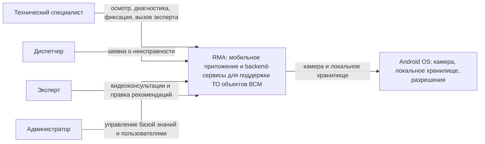

# 02. Контекст и границы

## Цель

Раздел показывает RMA в окружении: кто использует систему, какие внешние зависимости важны для MVP и где проходит граница ответственности.

## Граница системы

Внутри RMA находятся мобильное приложение специалиста, backend-сервисы (включая ИИ-контур и видеосвязь с экспертом), Admin Panel, хранилища, синхронизация базы знаний и журналов. Внешними остаются Android OS и корпоративная инфраструктура развертывания.

## Контекстная диаграмма

## Входы и выходы

| Поток | Направление | Назначение |
|---|---|---|
| Заявка о неисправности | Диспетчер -> RMA | Постановка задания на осмотр и его контроль |
| Фото шильдика | Специалист -> Мобильное приложение | Локальное извлечение маркировки и определение объекта |
| Текст проблемы | Специалист -> Мобильное приложение | Локальный поиск или онлайн-диагностика RAG/LLM |
| Голосовое описание | Специалист -> Speech Service | Онлайн STT при наличии сети |
| Видеоконсультация | Специалист <-> Эксперт (Expert/Collaboration Service) | Разбор сложного случая по видеосвязи |
| Версия базы знаний | Backend -> Мобильное приложение | Обновление полной локальной базы знаний |
| Журнал действий | Мобильное приложение -> Operation Log/Sync Service | Синхронизация выполненных операций |
| Разобранный случай | Мобильное приложение/Эксперт -> Learning/Feedback Service | Пополнение базы знаний по итогам осмотра |
| Инструкции и чек-листы | Admin Panel -> Documentation Service | Наполнение и публикация базы знаний |

## Внутри MVP

- Мобильное приложение.
- API Gateway/Auth.
- Documentation Service.
- Knowledge Sync Service.
- Search/RAG Service.
- Speech Service.
- Operation Log/Sync Service.
- Dispatch/Ticketing Service.
- Expert/Collaboration Service.
- Learning/Feedback Service.
- Admin Panel.
- База знаний, журнал операций, объектное хранилище вложений, индекс поиска, медиа-инфраструктура видеосвязи.

## Вне MVP

- Поддержка iOS.
- Измерения и видео-вложения (перенесено в развитие).
