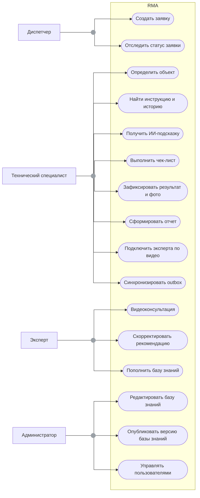

# 03. Требования

## Функциональные требования

| Код | Требование | Приоритет | Как проверить |
|---|---|---|---|
| FR-001 | Диспетчер создает заявку о неисправности, специалист получает задание и видит его статус | Must | Сценарий через Dispatch/Ticketing |
| FR-002 | Приложение определяет объект: локальный OCR шильдика, выбор из заявки или ручной выбор | Must | Демонстрация на тестовых шильдиках и из заявки |
| FR-003 | Приложение находит объект, документацию и историю в локальной базе знаний | Must | Интеграционный тест локального поиска |
| FR-004 | Полная база знаний хранится локально; инструкции и чек-листы доступны без сети | Must | E2E offline |
| FR-005 | При наличии сети ИИ-контур (RAG + LLM) формирует подсказку по базе знаний со ссылками на источники | Must | Интеграционный тест Search/RAG Service |
| FR-006 | Специалист эскалирует сложный случай эксперту по видеосвязи; эксперт правит рекомендацию и подтверждает решение | Must | E2E-сценарий видеоконсультации |
| FR-007 | Специалист выполняет чек-лист и фиксирует результат осмотра (фото, комментарии); локально создаются MaintenanceJob и OperationLog | Must | E2E-сценарий выполнения чек-листа |
| FR-008 | Приложение синхронизирует локальный outbox при появлении сети | Must | Интеграционный тест повторной синхронизации |
| FR-009 | Система формирует отчет по выполненному осмотру | Must | E2E-проверка автоподготовки отчета |
| FR-010 | Разобранный случай становится кандидатом в базу знаний и публикуется после проверки эксперта или администратора | Must | Интеграционный тест Learning/Feedback Service |
| FR-011 | Backend публикует полную или инкрементальную версию базы знаний | Must | Contract test API обновления |
| FR-012 | Администратор управляет объектами, инструкциями, чек-листами, версиями базы знаний и пользователями | Must | Сценарий через Admin Panel |
| FR-013 | При наличии сети доступны голосовой ввод и подсказки (STT/TTS); ручной текстовый ввод обязателен как fallback | Should | Интеграционный тест Speech Service и сценарий fallback |

## Нефункциональные требования

| Код | Требование | Приоритет | Как проверить |
|---|---|---|---|
| NFR-001 | Офлайн-сценарий (OCR, поиск, чек-лист, фиксация, черновик отчета) работает без backend | Must | Демонстрация с отключенной сетью |
| NFR-002 | Повторная синхронизация outbox не создает дубликаты OperationLog | Must | Failure test с повторной отправкой |
| NFR-003 | Клиент явно показывает недоступность ИИ-контура, Speech и видеосвязи без сети | Should | UI/E2E-проверка деградации |
| NFR-004 | ИИ-подсказка обоснована источниками из базы знаний; пользовательский ввод отделен от системных инструкций | Must | Тест grounding и защита от prompt injection |
| NFR-005 | Backend-сервисы логируют correlation_id, client_operation_id, operation_event_id | Must | Проверка структурных логов |
| NFR-006 | Доступ к заявкам, операциям и вложениям проверяется по роли и владельцу данных | Must | Security integration tests |
| NFR-007 | Новая версия базы знаний не ломает уже начатую операцию | Must | Тест совместимости instruction_version |
| NFR-008 | Валидация внешних входов обязательна: заявка, фото, текст, голос, видео-сигналинг, admin payload | Must | Unit и integration tests валидации |
| NFR-009 | Ресурсоемкие сервисы (ИИ-контур, Speech, видеосвязь) масштабируются независимо | Should | Архитектурное ревью и нагрузочные проверки |

## Продуктовые правила

| Правило | Значение | Где применяется | Как проверить |
|---|---|---|---|
| Целевая платформа MVP | Планшет (приоритет) и смартфон на Android | Мобильное приложение, deployment, тесты | Acceptance tests |
| Локальная база знаний | Кэшируется целиком | Мобильное приложение, Knowledge Sync Service | Offline E2E |
| ИИ-контур и видеосвязь | Только онлайн; базовый осмотр офлайн | Search/RAG, Speech, Expert/Collaboration | Сценарий отказа сети |
| Размещение LLM | Self-hosted на GPU; данные не уходят наружу | Search/RAG Service, deployment | Архитектурное ревью, ADR |
| Идемпотентность журнала | По idempotency_key и operation_event_id | Operation Log/Sync Service | Повторная синхронизация |
| Пополнение базы знаний | Через проверку эксперта или администратора | Learning/Feedback, Documentation Service | Сценарий публикации кандидата |

## Use-case обзор

## Ошибочные и альтернативные сценарии

| Сценарий | Ожидаемое поведение |
|---|---|
| OCR не распознал шильдик | Специалист выбирает объект из заявки или вводит маркировку вручную |
| Объект не найден в базе знаний | Создается локальная запись об ошибке поиска; специалист выбирает инструкцию вручную |
| Нет сети | Работают локальный OCR, база знаний, чек-листы, фиксация и черновик отчета; ИИ-контур, Speech и видеосвязь недоступны |
| Search/RAG Service недоступен | Приложение использует локальный поиск и ручной ввод |
| Speech Service недоступен | Приложение использует текстовый ввод |
| Эксперт недоступен | Специалист продолжает по локальной инструкции или откладывает сложный случай; запрос консультации остается в ожидании |
| Синхронизация outbox повторилась | Operation Log/Sync Service применяет событие один раз |
| База знаний обновилась во время операции | Операция продолжает ссылаться на instruction_version, с которой была начата |
