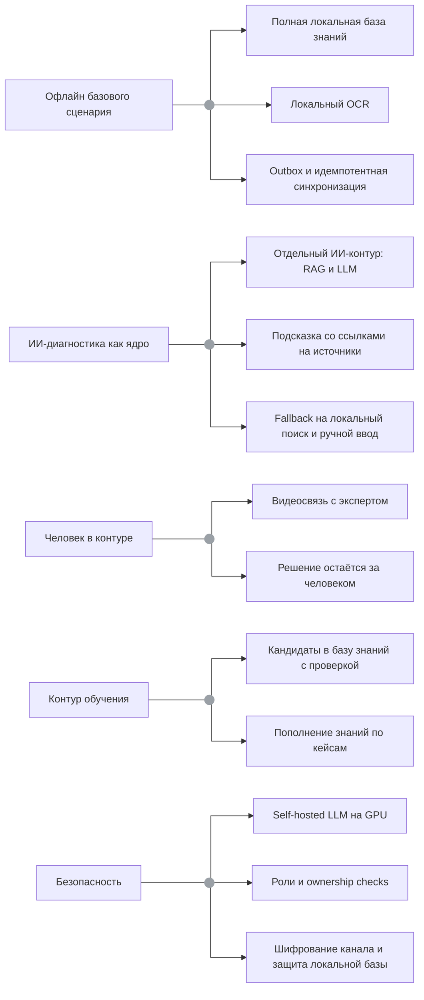

# 04. Архитектурные драйверы

## Ключевые драйверы

| Драйвер | Почему важен | Влияние на архитектуру | Как проверять |
|---|---|---|---|
| Офлайн базового сценария (доступность) | Специалист работает на участке с нестабильной связью | Полная база знаний, OCR, чек-листы, журнал и outbox хранятся локально; автосинхронизация при связи | Offline E2E |
| ИИ-диагностика как ядро ценности | Главная польза системы - обоснованная подсказка по базе знаний | Отдельный ИИ-контур (Search/RAG + LLM), grounding по источникам, безопасная деградация | Integration и contract tests |
| Человек в контуре (эксперт) | Сложные случаи требуют решения эксперта, ИИ только подсказывает | Expert/Collaboration Service: видеосвязь, правка рекомендаций, подтверждение решения | E2E видеоконсультации |
| Контур обучения | Каждый разобранный случай должен улучшать будущие подсказки | Learning/Feedback Service: кандидаты в базу знаний с проверкой эксперта или администратора | Integration test |
| Актуальность и идемпотентность синхронизации | Устаревшая инструкция опасна, а outbox может слать события повторно | Knowledge Sync управляет версиями; `operation_event_id` и `idempotency_key` обязательны | Тест обновления, failure tests |
| Безопасность данных обслуживания и базы знаний | Журналы и база знаний содержат чувствительные данные | Аутентификация, роли, ownership checks, шифрование канала, self-hosted LLM (данные не уходят наружу), защита локальной базы знаний | Security tests |
| Удобство в полевых условиях | Работа в перчатках, при разном освещении, с минимумом шагов | Голосовой ввод, крупные элементы интерфейса, минимум шагов фиксации | Usability и ручные проверки |
| Расширяемость контента и моделей | Новые объекты, инструкции и модели не должны требовать переписывания клиента | Documentation Service отделён от клиента; RAG индексирует контент; LLM подключается через адаптер | Acceptance scenario, архитектурное ревью |
| Сопровождаемость через разделение контуров | Контент, синхронизацию, ИИ и видеосвязь нужно развивать и масштабировать независимо | Backend как набор отдельных сервисов под логической рамкой 4 контуров; мониторинг качества подсказок | Архитектурное ревью |

## Компромиссы

| Решение | Выигрыш | Цена |
|---|---|---|
| Полная база знаний на устройстве | Офлайн-работа и быстрый локальный поиск | Нужно контролировать размер, версии и миграции |
| OCR локально | Сканирование возможно без сети | Точность зависит от камеры, освещения и локальной модели |
| ИИ-функции (RAG/LLM/STT/TTS) только онлайн | Можно использовать тяжёлые и качественные модели | При потере сети эти функции недоступны |
| Self-hosted LLM на GPU | Данные базы знаний и кейсов не уходят наружу, полный контроль | Нужна GPU-инфраструктура и её эксплуатация |
| Эксперт по видеосвязи | Качественное решение сложных случаев | Зависимость от связи и доступности эксперта |
| Контур обучения с проверкой кандидатов | Знания улучшаются, без «фантазий» модели в базе | Нужна модерация кандидатов экспертом или администратором |
| Backend как набор отдельных сервисов | Независимое масштабирование и развитие контуров | Больше контрактов, мониторинга и интеграционных тестов |

## Карта влияния

## Решения, требующие ADR

- Выделить backend в набор отдельных сервисов.
- Хранить полную базу знаний локально на устройстве.
- Оставить OCR локальным, а LLM/RAG/STT/TTS выполнять онлайн.
- Размещать LLM-ядро self-hosted на GPU.
- Ввести контур эксперта (видеосвязь, человек в контуре).
- Ввести контур обучения на разобранных случаях с проверкой кандидатов.

## Допущения

- Размер полной базы знаний допустим для хранения на типовом планшете целевой аудитории.
- Инкрементальные обновления базы знаний можно применять без полной переустановки приложения.
- Серверные ИИ-сервисы и видеосвязь могут быть временно недоступны без остановки базового осмотра.
- Доступна GPU-инфраструктура для self-hosted LLM.
- Кандидаты в базу знаний проходят проверку эксперта или администратора перед публикацией.
