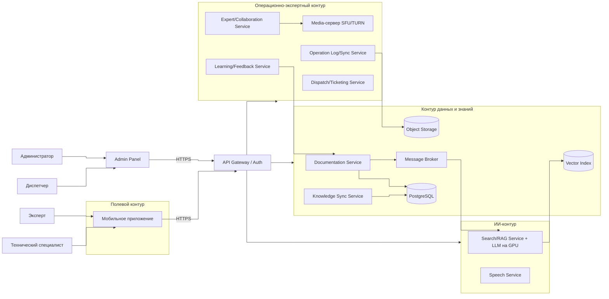
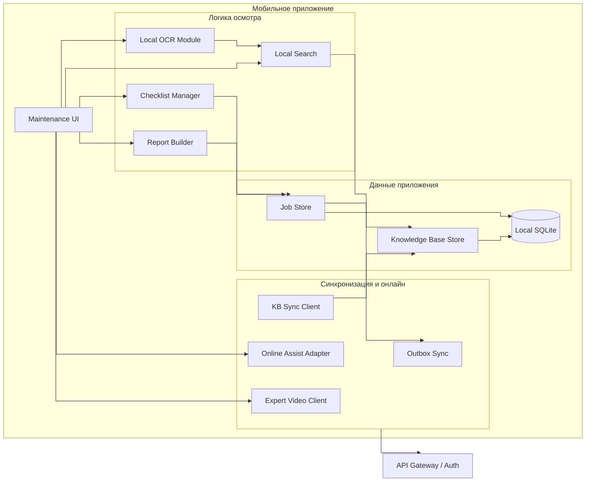

# 05. Архитектура

## Архитектурный стиль

RMA строится как offline-capable мобильное приложение и набор специализированных backend-сервисов, сгруппированных в четыре логических контура:

- **Полевой контур** - мобильное приложение специалиста: локальный OCR, полная база знаний, чек-листы, журнал и outbox; работает без сети.
- **Контур данных и знаний** - публикация и выдача контента: Documentation Service, Knowledge Sync Service и общий слой данных.
- **ИИ-контур** - тяжёлые онлайн-функции: Search/RAG Service с self-hosted LLM и Speech Service.
- **Операционно-экспертный контур** - заявки, журналы, видеосвязь и обучение: Dispatch/Ticketing, Operation Log/Sync, Expert/Collaboration и Learning/Feedback.

Сквозные элементы - API Gateway/Auth и Admin Panel - обслуживают все контуры.

## Контейнерная диаграмма

Локальное хранилище (`Local SQLite`) не показано как отдельный контейнер: это встроенное хранилище внутри мобильного приложения, его ответственность раскрыта на компонентной диаграмме и в разделе данных. `PostgreSQL` - общий слой состояния всех backend-сервисов; на диаграмме показаны только специализированные хранилища (Vector Index для Search/RAG, Object Storage для Operation Log/Sync) и ключевые связи, полная матрица - в таблице ниже и в разделе 07. Media-сервер (SFU/TURN) обеспечивает потоки видеосвязи между специалистом и экспертом.

| Откуда | Куда | Назначение |
|---|---|---|
| Мобильное приложение | API Gateway/Auth | Синхронизация, обновление базы знаний, онлайн-диагностика, видеосвязь |
| Admin Panel | API Gateway/Auth | Администрирование контента и заявок |
| API Gateway/Auth | Backend-сервисы | Авторизованная маршрутизация запросов |
| Documentation Service | PostgreSQL, Message Broker | Хранение контента и события публикации |
| Knowledge Sync Service | PostgreSQL | Чтение опубликованных версий базы знаний |
| Search/RAG Service | PostgreSQL, Vector Index | Онлайн-поиск и RAG по опубликованной базе знаний |
| Operation Log/Sync Service | PostgreSQL, Object Storage | Идемпотентный приём журналов и вложений |
| Dispatch/Ticketing Service | PostgreSQL | Жизненный цикл заявок и заданий |
| Learning/Feedback Service | PostgreSQL, Documentation Service | Кандидаты в базу знаний по итогам кейсов |
| Expert/Collaboration Service | Media-сервер | Установление и проведение видеосессии |

## Ответственность контейнеров

| Контейнер | Ответственность |
|---|---|
| Мобильное приложение | Основной UI специалиста, локальный OCR, поиск, чек-листы, журналы, outbox, видеоклиент |
| API Gateway/Auth | Авторизация, проверка токенов, маршрутизация, выдача `correlation_id` |
| Documentation Service | Управление объектами, инструкциями, чек-листами и версиями |
| Knowledge Sync Service | Выдача полной базы знаний и инкрементальных обновлений |
| Search/RAG Service | Онлайн-диагностика: семантический поиск, RAG и генерация LLM по опубликованной базе знаний |
| Speech Service | STT/TTS при наличии сети |
| Dispatch/Ticketing Service | Создание заявок, выдача заданий, контроль статуса |
| Operation Log/Sync Service | Приём outbox-событий, идемпотентность, сохранение журналов и вложений |
| Expert/Collaboration Service | Видеосвязь специалиста с экспертом через Media-сервер, фиксация правок рекомендаций |
| Learning/Feedback Service | Сбор разобранных случаев и подготовка кандидатов в базу знаний |
| Media-сервер (SFU/TURN) | Медиапотоки видеосвязи специалиста и эксперта |
| Admin Panel | Интерфейс администратора и диспетчера |

## Компоненты мобильного приложения

## Ключевые политики

| Политика | Где реализуется | Почему здесь | Как проверить |
|---|---|---|---|
| Версионирование базы знаний | Documentation, Knowledge Sync, приложение | Клиент должен знать, какую версию хранит | Contract и integration tests |
| Фиксация версии инструкции в операции | Checklist Manager, Job Store | Операция продолжается с инструкцией, с которой началась | E2E-тест обновления во время операции |
| Идемпотентность outbox | Приложение, Operation Log/Sync | Сеть обрывается, события могут отправляться повторно | Failure test |
| Grounding и человек в контуре | Search/RAG, Expert/Collaboration | ИИ не решает сам: подсказка со ссылками, решение за человеком | Integration и E2E |
| Fallback онлайн-функций | Приложение | Не терять базовый сценарий при отказе RAG/STT/TTS/видео | E2E-тест отказа сервисов |
| Проверка кандидатов в базу знаний | Learning/Feedback, Documentation | Не допускать «фантазии» модели в публикуемый контент | Integration test |
| Self-hosted LLM, данные не уходят наружу | Search/RAG, deployment | Безопасность базы знаний и кейсов | Архитектурное ревью |
| Ownership checks | API Gateway/Auth, Operation Log/Sync, Dispatch | Специалист не видит чужие заявки и операции | Security tests |

## ADR

- [ADR-0001: Выделить backend в отдельные сервисы](adr/0001-выделить-backend-в-отдельные-сервисы.md)
- [ADR-0002: Хранить полную базу знаний локально](adr/0002-хранить-полную-базу-знаний-локально.md)
- [ADR-0003: Разделить локальный OCR и онлайн AI-функции](adr/0003-разделить-локальный-ocr-и-онлайн-ai-функции.md)
- [ADR-0004: Исключить EAM-интеграцию из проекта](adr/0004-исключить-eam-интеграцию.md)
- [ADR-0005: Разместить LLM-ядро self-hosted на GPU](adr/0005-self-hosted-llm.md)
- [ADR-0006: Ввести контур эксперта с видеосвязью](adr/0006-контур-эксперта.md)
- [ADR-0007: Ввести контур обучения на разобранных случаях](adr/0007-контур-обучения.md)
