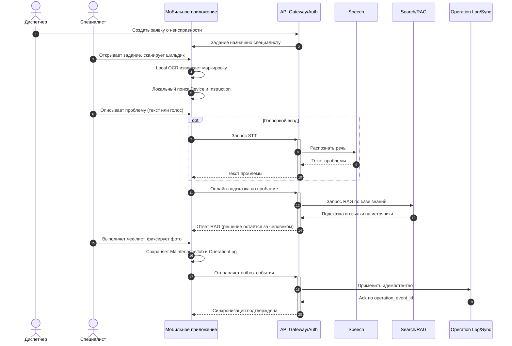
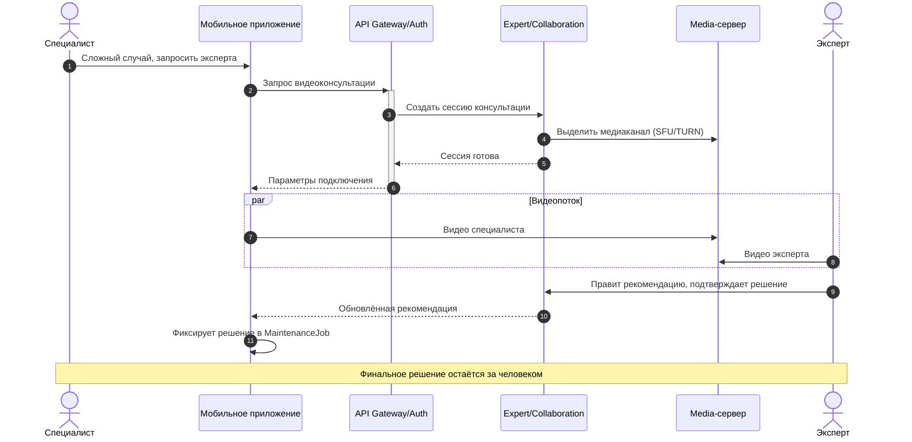
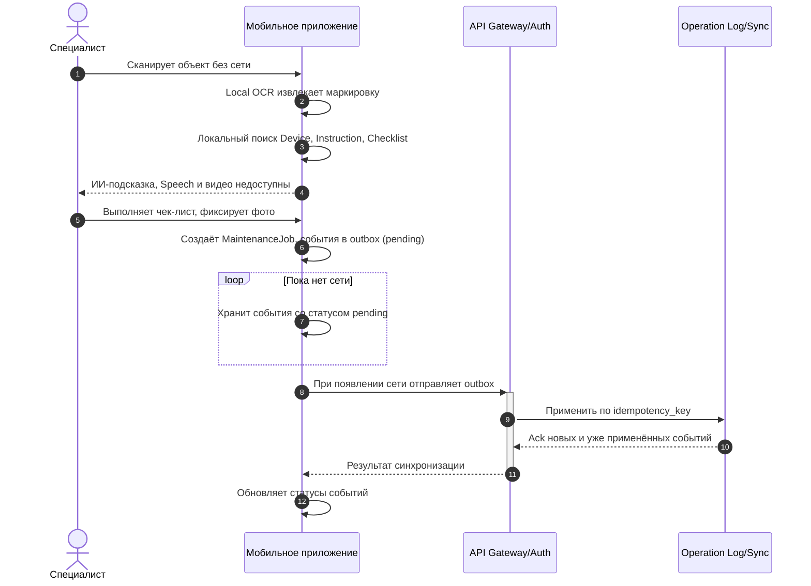
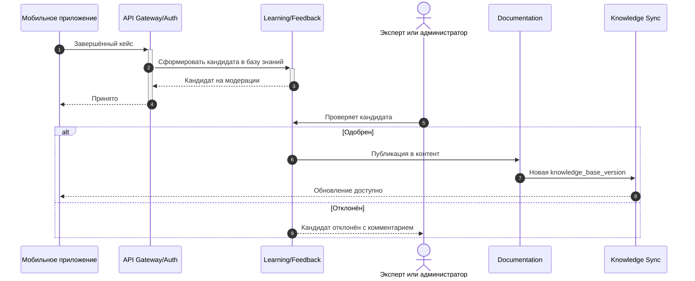
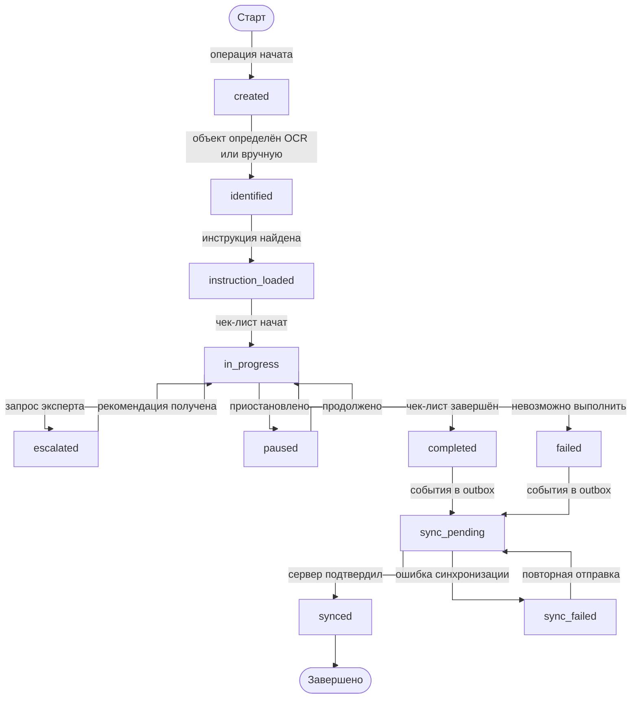

# 06. Сценарии и потоки

## Основной онлайн-сценарий

Сеть доступна: специалист получает задание по заявке, использует локальный OCR и базу знаний, а также онлайн-помощь RAG и Speech.



## Эскалация эксперту по видеосвязи

Если случай сложный, специалист подключает эксперта; ИИ только подсказывал, решение принимает человек.



## Офлайн-сценарий с последующей синхронизацией

Базовый сценарий не зависит от сети: вся база знаний уже на устройстве, тяжёлые онлайн-функции недоступны.



## Контур обучения

Разобранный случай (особенно после правок эксперта) становится кандидатом в базу знаний и публикуется только после проверки человеком.



## Обновление базы знаний

1. Администратор меняет объекты, инструкции или чек-листы в Admin Panel; одобренные кандидаты из контура обучения тоже попадают в контент.
2. Documentation Service сохраняет черновик и после публикации создаёт новую `knowledge_base_version`.
3. Knowledge Sync Service готовит пакет полной базы знаний или инкрементальное обновление.
4. Мобильное приложение периодически проверяет доступную версию.
5. Клиент скачивает обновление, проверяет контрольную сумму и применяет миграцию локального хранилища.
6. Уже начатые операции продолжают ссылаться на старую `instruction_version`.
7. Новые операции используют актуальную версию базы знаний.

## Жизненный цикл MaintenanceJob



## Правила повторов

| Повтор | Правило |
|---|---|
| Повторная отправка `OperationLog` | Сервер применяет событие один раз по `operation_event_id` и `idempotency_key` |
| Повторная загрузка обновления базы знаний | Клиент проверяет `knowledge_base_version` и контрольную сумму |
| Повторный OCR одного шильдика | Создаёт новую попытку распознавания внутри той же операции |
| Повторный онлайн-RAG запрос | Не меняет состояние операции, сохраняется как подсказка |
| Повторное подключение к эксперту | Создаёт новую сессию консультации, не меняя историю операции |
| Повторная отправка кандидата в базу знаний | Learning/Feedback дедуплицирует кандидата по исходному кейсу |

## Ошибочные и альтернативные ветки

- Если OCR не уверен в результате, специалист подтверждает объект из заявки или вручную.
- Если локальная база знаний повреждена, приложение блокирует начало новых операций и требует повторной загрузки базы знаний.
- Если RAG или Speech недоступны, остаётся локальный поиск и ручной текстовый ввод.
- Если эксперт недоступен, специалист продолжает по локальной инструкции или откладывает сложный случай; запрос консультации остаётся в ожидании.
- Если синхронизация вложения не удалась, `OperationLog` остаётся в outbox до успешной отправки.
- Если сервер вернул конфликт версии, клиент не меняет завершённую операцию, а сохраняет диагностическое событие.
```
