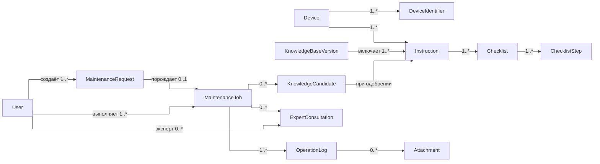

# 07. Данные и хранилища

## Основные сущности

| Сущность | Назначение | Ключевые поля |
|---|---|---|
| User | Специалист, диспетчер, эксперт или администратор | `id`, `role`, `qualification_level` |
| MaintenanceRequest | Заявка о неисправности от диспетчера | `request_id`, `device_id`, `status`, `created_by`, `assigned_to`, `created_at` |
| Device | Объект инфраструктуры ВСМ | `device_id`, `type`, `model`, `serial_number`, `location_hint` |
| DeviceIdentifier | Признаки шильдика | `id`, `device_id`, `identifier_type`, `value` |
| Instruction | Инструкция или решение по объекту | `instruction_id`, `device_id`, `instruction_version`, `title`, `status` |
| Checklist | Набор шагов операции | `checklist_id`, `instruction_id`, `instruction_version` |
| ChecklistStep | Отдельный шаг чек-листа | `step_id`, `checklist_id`, `order`, `text`, `required` |
| KnowledgeBaseVersion | Опубликованная версия базы знаний | `knowledge_base_version`, `published_at`, `checksum`, `status` |
| MaintenanceJob | Сессия обслуживания (карточка осмотра) | `client_operation_id`, `server_operation_id`, `request_id`, `user_id`, `device_id`, `instruction_version`, `status`, `created_at` |
| OperationLog | Событие или запись о выполненной работе | `operation_event_id`, `client_operation_id`, `idempotency_key`, `event_type`, `payload`, `created_at`, `sync_status` |
| Attachment | Фото или другой разрешённый артефакт | `attachment_id`, `operation_event_id`, `type`, `local_uri`, `storage_url`, `checksum` |
| ExpertConsultation | Видеоконсультация с экспертом по операции | `consultation_id`, `client_operation_id`, `expert_id`, `status`, `started_at`, `outcome` |
| KnowledgeCandidate | Кандидат в базу знаний по итогам кейса | `candidate_id`, `client_operation_id`, `status`, `reviewed_by`, `payload`, `created_at` |
| OutboxEvent | Локальное событие, ожидающее синхронизации | `event_id`, `type`, `status`, `attempts` |

## Диаграмма сущностей и связей



## Хранилища

| Хранилище | Где находится | Ответственность |
|---|---|---|
| Local SQLite | Устройство | Полная база знаний, локальные операции, назначенные заявки, outbox, статусы синхронизации |
| PostgreSQL | Backend data layer | Пользователи, версии базы знаний, серверные журналы, заявки, консультации, кандидаты |
| Vector Index | Backend data layer | Векторный индекс для Search/RAG Service |
| Object Storage | Backend data layer | Фото и другие вложения к операциям |
| Message Broker | Backend infrastructure | Фоновая индексация, публикация версий, обработка кейсов |

Media-сервер (SFU/TURN) передаёт видеопотоки консультаций транзитом и не является хранилищем: записи видео в MVP не хранятся, метаданные консультации (`ExpertConsultation`) лежат в PostgreSQL.

## Источник истины

- Для опубликованной базы знаний источник истины - backend: Documentation Service и PostgreSQL.
- Для заявок источник истины - Dispatch/Ticketing Service и PostgreSQL.
- Для текущей офлайн-операции до синхронизации источник истины - Local SQLite на устройстве.
- После успешной синхронизации серверная запись `OperationLog` становится источником истины для отчётности.
- Для кандидатов в базу знаний источник истины - Learning/Feedback Service и PostgreSQL до публикации.
- Vector Index не является источником истины: его можно перестроить по опубликованным инструкциям.
- Object Storage хранит артефакты, а metadata и связи с операцией хранятся в PostgreSQL.

## Правила хранения

| Данные или артефакт | Источник истины | Срок хранения | Как удалить или восстановить |
|---|---|---|---|
| Опубликованная база знаний | Backend PostgreSQL | Пока версия поддерживается | Повторно скачать на клиент или восстановить из backup |
| Локальная база знаний | Local SQLite | До замены новой версией | Повторная загрузка `knowledge_base_version` |
| Заявка | Backend PostgreSQL | По политике эксплуатации | Восстановить из backup |
| MaintenanceJob до sync | Local SQLite | До успешной синхронизации и локальной retention | Повторить outbox sync |
| OperationLog после sync | Backend PostgreSQL | По политике аудита | Восстановить из backup или audit trail |
| Attachment | Object Storage | По политике хранения вложений | Metadata остаётся в PostgreSQL |
| ExpertConsultation | Backend PostgreSQL | По политике аудита (без видеозаписи) | Восстановить метаданные из backup |
| KnowledgeCandidate | Backend PostgreSQL | До публикации или отклонения | Пересоздать из исходного кейса |
| Vector Index | Vector storage | Пока актуальна версия базы знаний | Перестроить по Instruction |

## Миграции и совместимость

- Каждая опубликованная база знаний имеет `knowledge_base_version`.
- Каждая инструкция имеет `instruction_version`.
- `MaintenanceJob` фиксирует `instruction_version`, чтобы операция не изменилась при обновлении базы знаний.
- Инкрементальные обновления применяются только после проверки контрольной суммы.
- При несовместимой миграции клиент скачивает полную версию базы знаний.

## Данные для идемпотентности

- `client_operation_id` создаётся на устройстве и уникален в пределах устройства.
- `operation_event_id` создаётся для каждого события журнала.
- `idempotency_key` передаётся при синхронизации и хранится на сервере.
- Сервер хранит факт применения события и возвращает ack при повторной отправке.
- Кандидаты в базу знаний дедуплицируются по исходному кейсу (`client_operation_id`).
- `correlation_id` связывает HTTP-запрос, обработку backend-сервиса и запись журнала.
```
