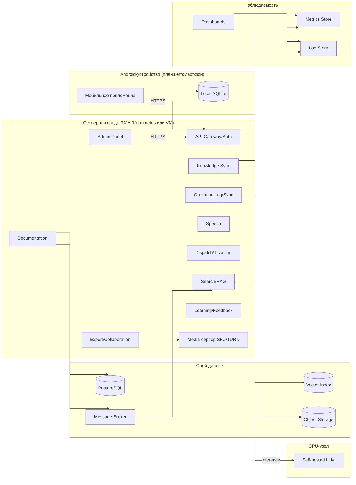

# 08. Развертывание

## Целевая среда MVP

MVP разворачивается в нескольких средах:

- Android-устройства специалистов: планшеты (приоритет) и смартфоны.
- Серверная среда RMA: backend-сервисы, Admin Panel, Media-сервер и observability.
- GPU-узел: self-hosted LLM для Search/RAG Service.
- Слой данных: PostgreSQL, Vector Index, Object Storage, Message Broker.

## Диаграмма развертывания

Для наглядности показаны ключевые связи между узлами; все backend-сервисы используют общий PostgreSQL (полная матрица - в разделах 05 и 07).

## Сетевые связи

| Откуда | Куда | Протокол | Назначение |
|---|---|---|---|
| Мобильное приложение | API Gateway/Auth | HTTPS | Синхронизация, обновления, онлайн-помощь, видеосигналинг |
| Admin Panel | API Gateway/Auth | HTTPS | Управление контентом и заявками |
| API Gateway/Auth | Backend-сервисы | Internal HTTP/gRPC | Маршрутизация команд и запросов |
| Backend-сервисы | PostgreSQL | DB protocol | Хранение состояния и контента |
| Search/RAG Service | Vector Index | Vector API | Семантический поиск |
| Search/RAG Service | Self-hosted LLM (GPU) | Internal API | Генерация ответа |
| Operation Log/Sync Service | Object Storage | Object API | Загрузка вложений |
| Documentation Service | Message Broker | Broker protocol | События публикации и переиндексации |
| Мобильное приложение и эксперт | Media-сервер | WebRTC (SRTP/TURN) | Видеопотоки консультаций |
| Expert/Collaboration Service | Media-сервер | Internal API | Управление видеосессией |

## Stateful и stateless компоненты

| Компонент | Тип |
|---|---|
| Мобильное приложение | Stateful из-за Local SQLite |
| Local SQLite | Stateful |
| API Gateway/Auth | Stateless |
| Documentation, Knowledge Sync, Dispatch/Ticketing, Operation Log/Sync, Learning/Feedback | Stateless при внешнем PostgreSQL |
| Search/RAG Service | Stateless (использует Vector Index и LLM) |
| Speech Service | Stateless, ресурсоёмкий |
| Expert/Collaboration Service | Stateless, сессии хранятся в PostgreSQL |
| Self-hosted LLM | Stateful по весам модели, ресурсоёмкий (GPU) |
| Media-сервер | Stateful по активным сессиям (транзит, без записи) |
| PostgreSQL, Vector Index, Object Storage, Message Broker | Stateful |

## Конфигурация и секреты

- Секреты backend-сервисов хранятся в защищённом secret storage среды развертывания.
- Мобильное приложение не хранит серверные секреты; оно хранит только пользовательские токены и локальные ключи в защищённом хранилище Android.
- API Gateway/Auth отвечает за проверку токенов и передачу user context во внутренние сервисы.
- Доступ к self-hosted LLM и Media-серверу разрешён только из доверенной серверной зоны.
- Адреса сервисов и feature flags задаются через окружение backend и remote config клиента.

## Масштабирование

- Search/RAG Service и self-hosted LLM масштабируются на GPU-узлах отдельно как самые ресурсоёмкие.
- Speech Service масштабируется отдельно от остальных сервисов.
- Media-сервер масштабируется по числу одновременных видеосессий.
- Operation Log/Sync Service масштабируется по нагрузке outbox-синхронизации.
- Knowledge Sync Service масштабируется по числу клиентов, скачивающих обновления.
- Мобильное приложение не зависит от горизонтального масштабирования backend для офлайн-сценария.
