# 09. Надежность и эксплуатация

## Ключевые отказы

| Отказ | Поведение системы |
|---|---|
| Нет сети у специалиста | Приложение продолжает локальный OCR, поиск по базе знаний, чек-лист и запись OperationLog |
| Search/RAG Service недоступен | Клиент использует локальный поиск; онлайн-подсказка помечается недоступной |
| Self-hosted LLM или GPU недоступны | Search/RAG отключает генерацию подсказки; остаётся семантический и локальный поиск |
| Speech Service недоступен | Клиент использует ручной текстовый ввод |
| Эксперт или Media-сервер недоступны | Видеоконсультация невозможна; специалист продолжает по локальной инструкции или откладывает случай |
| Dispatch/Ticketing недоступен | Новые заявки не создаются; осмотр можно начать вручную без заявки |
| Learning/Feedback недоступен | Кандидаты в базу знаний откладываются; базовый сценарий не страдает |
| Синхронизация outbox прервалась | События остаются `pending` и отправляются повторно |
| Повторная доставка outbox-события | Operation Log/Sync Service применяет событие один раз |
| Knowledge Sync Service недоступен | Клиент продолжает работать с текущей `knowledge_base_version` |
| Локальная база знаний повреждена | Клиент блокирует новые операции и требует повторной загрузки базы знаний |
| Переиндексация RAG не завершилась | Search/RAG использует предыдущий индекс или отключает онлайн-подсказки для новой версии |

## Повторы и идемпотентность

- Каждое событие outbox имеет `operation_event_id` и `idempotency_key`.
- Сервер хранит факт применения события и возвращает ack при повторной отправке.
- Вложения синхронизируются с checksum; повторная загрузка не создаёт новый артефакт без необходимости.
- Обновления базы знаний применяются только после проверки `knowledge_base_version` и checksum.
- RAG, Speech и видеоконсультации не меняют критичное состояние операции и могут повторяться без влияния на `MaintenanceJob`.
- Кандидаты в базу знаний дедуплицируются по исходному кейсу и не публикуются без проверки человеком.

## Диагностическая цепочка

```mermaid
%%{init: {'flowchart': {'curve': 'stepBefore'}}}%%
flowchart LR
    subgraph Sources["Источники сигналов"]
        App[Мобильное приложение]
        GW[API Gateway/Auth]
        Svc[Backend-сервисы]
        Infra[Хранилища и очередь]
    end
    subgraph Signals["Сигналы с correlation_id"]
        Logs[Структурные логи]
        Metrics[Метрики]
        Events[Доменные события]
    end
    subgraph ObsStores["Хранилища наблюдаемости"]
        LogStore[Log Store]
        MetricStore[Metrics Store]
        State[PostgreSQL и статусы sync]
    end
    subgraph Views["Панели"]
        SyncView[Outbox sync]
        KBView[Версии базы знаний]
        AIView[RAG, LLM и Speech]
        ExpView[Видеоконсультации]
        OpsView[Операции и заявки]
    end
    Alert[Алерты]

    Sources --> Signals
    Signals --> ObsStores
    ObsStores --> Views
    Views --> Alert
```

## Минимальный набор сигналов

| Тип сигнала | Что включить | Зачем |
|---|---|---|
| Android logs | `client_operation_id`, `operation_event_id`, `knowledge_base_version`, `sync_status`, `error_code` | Разбор локальных и sync-сбоев |
| Backend logs | `correlation_id`, `user_id`, `service`, `operation_event_id`, `idempotency_key`, `error_code` | Связать запросы и события между сервисами |
| Metrics | Возраст outbox, число pending events, ошибки sync, версии базы знаний, latency RAG/LLM/STT/TTS, активные видеосессии | Раннее обнаружение деградации |
| Domain events | Создание заявки, начало и завершение операции, sync ack, sync conflict, эскалация эксперту, кандидат в базу знаний | Восстановление истории процесса |

## Алерты

| Алерт | Условие |
|---|---|
| Outbox sync деградирует | Растёт средний возраст pending-событий |
| Ошибки Knowledge Sync | Клиенты не могут скачать новую версию базы знаний |
| ИИ-сервисы недоступны | Ошибки Search/RAG, LLM или Speech выше порога |
| Видеоконсультации не устанавливаются | Доля неуспешных сессий Expert/Collaboration выше порога |
| Дубли outbox | Сервер часто получает уже применённые события сверх ожидаемого уровня |
| Ошибки локальной базы | Клиенты сообщают о повреждении базы знаний |

## Резервное копирование и восстановление

- PostgreSQL резервируется по расписанию и перед публикацией крупных обновлений базы знаний.
- Object Storage хранит вложения с metadata в PostgreSQL.
- Vector Index можно перестроить по опубликованной базе знаний.
- Метаданные консультаций и кандидаты в базу знаний резервируются вместе с PostgreSQL; видео не записывается.
- Local SQLite на устройстве не считается централизованным backup, но outbox хранится до успешной синхронизации.
- При потере устройства несинхронизированные операции могут быть потеряны; это отдельный риск MVP.

## Ручные действия оператора

- Проверить конкретную операцию по `client_operation_id` или заявку по `request_id`.
- Найти событие по `operation_event_id` и посмотреть, применено ли оно сервером.
- Повторно запустить сборку или публикацию `knowledge_base_version`.
- Отключить онлайн-RAG, LLM, Speech или видеоконсультации через feature flag при деградации.
- Посмотреть статус кандидата в базу знаний и при необходимости вернуть его на доработку.
- Запустить переиндексацию Vector Index для конкретной версии базы знаний.
