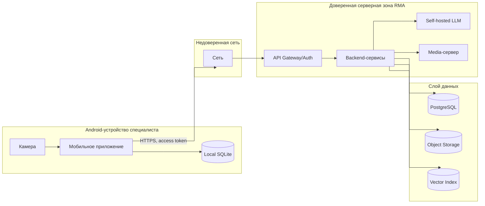

# 10. Безопасность

## Защищаемые данные

| Данные | Почему защищаются |
|---|---|
| Учётные записи и роли пользователей | Определяют доступ к операциям и админке |
| OperationLog и MaintenanceJob | Содержат сведения о работах, оборудовании и сотруднике |
| Заявки о неисправности | Содержат сведения об объектах и планах работ |
| Вложения к операциям | Могут содержать изображения оборудования или служебной информации |
| База знаний и кандидаты в неё | Содержат внутренние инструкции и регламенты |
| Видеопотоки консультаций | Содержат изображение объекта и обсуждение работ |
| Токены доступа | Позволяют обращаться к API |
| Логи и диагностические данные | Могут раскрывать идентификаторы объектов и детали операций |

## Роли и права

| Роль | Права |
|---|---|
| Технический специалист | Читать локальную базу знаний, создавать операции, синхронизировать свои журналы, вызывать эксперта |
| Диспетчер | Создавать заявки о неисправности и контролировать их статус |
| Эксперт | Подключаться к видеоконсультациям, править рекомендации, предлагать кандидатов в базу знаний |
| Администратор | Управлять объектами, инструкциями, версиями базы знаний и пользователями; проверять кандидатов |

## Границы доверия

## Аутентификация и авторизация

- Мобильное приложение обращается к backend через API Gateway/Auth.
- API Gateway/Auth проверяет токен пользователя и передаёт user context во внутренние сервисы.
- Operation Log/Sync Service проверяет, что специалист синхронизирует операцию от своего имени.
- Dispatch/Ticketing проверяет права диспетчера на создание и назначение заявок.
- Expert/Collaboration авторизует участников видеосессии и связывает её с конкретной операцией.
- Admin Panel доступна только пользователям с ролями администратора и диспетчера.
- Сервисные вызовы между backend-компонентами защищаются внутренней сетью и service credentials.

## Валидация входов

| Вход | Проверки |
|---|---|
| Заявка | Схема, обязательные поля, права диспетчера |
| Фото шильдика | Размер, формат, ограничения локальной обработки |
| Ручной текст | Длина, допустимые символы, защита от prompt injection в RAG-контексте |
| Голосовой ввод | Ограничение длительности и размера payload |
| Видео-сигналинг | Авторизация сессии, ограничения параметров подключения |
| Admin payload | Схема, обязательные поля, версии, права администратора |
| Кандидат в базу знаний | Схема, статус модерации, права проверяющего |
| Вложения | Тип файла, размер, checksum, связь с разрешённой операцией |
| Outbox events | Схема, `operation_event_id`, `idempotency_key`, владелец операции |

## Что нельзя логировать

- Access tokens и refresh tokens.
- Полные payload голосовых данных и содержимое видеопотоков.
- Содержимое вложений.
- Секреты сервисов.
- Избыточные персональные данные пользователя.

## Основные угрозы и меры

| Угроза | Мера снижения |
|---|---|
| Специалист синхронизирует чужую операцию | Ownership checks в Operation Log/Sync Service |
| Повторная отправка события меняет журнал дважды | Идемпотентность по `operation_event_id` и `idempotency_key` |
| Утечка базы знаний с устройства | Защищённое локальное хранилище Android и ограничение доступа приложения |
| Утечка данных базы знаний во внешний сервис | Self-hosted LLM: данные не покидают доверенную зону |
| Prompt injection через текст проблемы | Search/RAG отделяет пользовательский ввод от системных инструкций и цитирует источники |
| Перехват видеоконсультации | Шифрование медиапотоков (SRTP/TURN) и авторизация сессии |
| Отравление базы знаний вредоносным кандидатом | Обязательная проверка эксперта или администратора перед публикацией |
| Вредоносный admin payload | Валидация схемы и прав, аудит публикаций |
| Доступ к вложениям без прав | Object Storage не выдаёт публичные постоянные ссылки; доступ через авторизованный backend |

## Допущения

- В MVP не проектируется отдельная криптографическая схема для каждой инструкции.
- Корпоративный SSO может быть добавлен позже без изменения доменной модели ролей.
- Политика защиты локальной базы знаний уточняется при переходе к промышленному внедрению.
