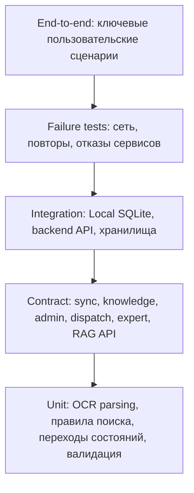

# 11. Тестирование

## Стратегия

Тестирование RMA должно проверять не только UI, но и архитектурные свойства: офлайн-работу, версионирование базы знаний, идемпотентную синхронизацию, обоснованность ИИ-подсказок, эскалацию эксперту и безопасную деградацию онлайн-функций.

## Тестовая пирамида

## Матрица критичных проверок

| Область | Что проверить | Тип проверки |
|---|---|---|
| Заявки | Создание заявки, назначение задания, статусы | Integration / E2E |
| OCR | Извлечение модели и серийного номера из тестовых шильдиков | Unit / integration |
| Локальный поиск | Device -> Instruction по полной базе знаний | Unit / integration |
| Офлайн-сценарий | OCR, поиск, чек-лист, фиксация без сети | E2E |
| Онлайн-диагностика | Подсказка RAG/LLM строится по базе знаний со ссылками на источники | Integration / contract |
| Эскалация эксперту | Видеоконсультация, правка рекомендации, подтверждение решения | Integration / E2E |
| Контур обучения | Кандидат проходит проверку и публикуется | Integration |
| Speech Service | STT/TTS доступен только онлайн, есть fallback | Integration / E2E |
| Outbox sync | Повторная отправка не создаёт дубликаты | Failure test |
| Версии базы знаний | Клиент применяет новую `knowledge_base_version` | Integration |
| Версия инструкции | Начатая операция сохраняет `instruction_version` | E2E |
| Права доступа | Специалист не получает чужие заявки, операции и вложения | Security integration |
| Mermaid-документация | Диаграммы рендерятся без ошибок | Static/render check |

## Сценарии приёмки MVP

1. Диспетчер создаёт заявку, специалист получает задание и видит его статус.
2. Специалист без сети сканирует объект, находит инструкцию локально, проходит чек-лист и создаёт `OperationLog`.
3. После появления сети приложение синхронизирует outbox; сервер подтверждает события, повторная отправка безопасна.
4. При наличии сети ИИ-подсказка строится по базе знаний и приводит ссылки на источники.
5. Специалист эскалирует сложный случай эксперту по видео; эксперт правит рекомендацию и подтверждает решение.
6. Разобранный случай становится кандидатом в базу знаний и публикуется после проверки.
7. Администратор публикует новую версию базы знаний; приложение скачивает и применяет обновление.
8. Search/RAG, Speech или видео недоступны; приложение показывает fallback и не блокирует локальный сценарий.
9. Пользователь с ролью специалиста не может получить заявку, журнал или вложение другого специалиста.

## Контрактные тесты

| Контракт | Что проверять |
|---|---|
| Knowledge Sync API | `knowledge_base_version`, checksum, full package, incremental package |
| Operation Sync API | `client_operation_id`, `operation_event_id`, `idempotency_key`, sync ack |
| Dispatch API | Создание заявки, назначение, статусы |
| Admin API | Схема объектов, инструкций, чек-листов, публикация версии |
| Search/RAG API | Запрос с текстом проблемы, ссылки на источники, безопасный fallback |
| Expert/Collaboration API | Создание сессии, авторизация участников, фиксация решения |
| Learning/Feedback API | Кандидат, статусы модерации, публикация |
| Speech API | Ограничения размера, формат ответа STT/TTS |

## Нагрузочные проверки

- Массовая загрузка новой `knowledge_base_version` клиентами после публикации.
- Пиковая синхронизация outbox после восстановления связи на участке.
- Рост числа RAG-запросов и нагрузки на self-hosted LLM при наличии сети.
- Число одновременных видеоконсультаций на Media-сервере.
- Длительность локального поиска по полной базе знаний на типовом устройстве.

## Ручные проверки

- Удобство сканирования шильдика при разном освещении.
- Понятность экрана деградации онлайн-функций.
- Читаемость чек-листа на смартфоне и планшете.
- Понятность статуса синхронизации и статуса заявки для специалиста.
- Качество видеосвязи с экспертом в полевых условиях.
