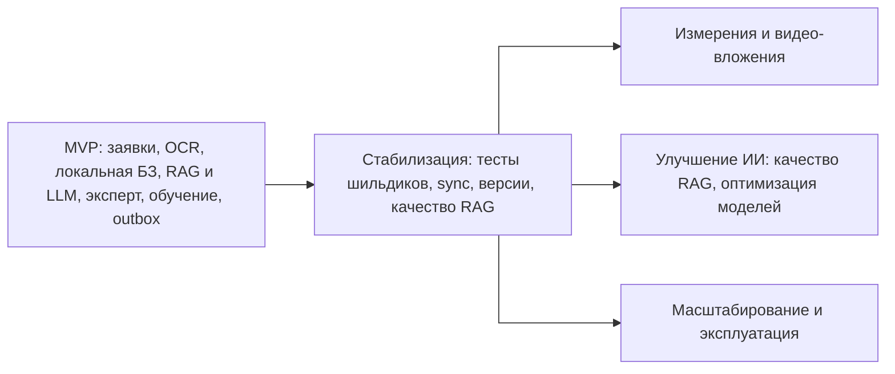

# 12. Риски и развитие

## Главные риски

| Риск | Вероятность | Влияние | Мера снижения |
|---|---|---|---|
| Полная база знаний слишком велика для устройства | Средняя | Высокое | Измерить размер, использовать инкременты, сжатие и cleanup старых версий |
| OCR ошибается на реальных шильдиках | Средняя | Высокое | Ручное подтверждение объекта, тестовый набор шильдиков, метрики точности |
| Специалист работает долго без сети, outbox растёт | Средняя | Среднее | Лимиты хранения, статус pending, retry policy, предупреждения |
| RAG/LLM даёт нерелевантную подсказку | Средняя | Высокое | Показывать источники, не заменять обязательную инструкцию, fallback на локальную базу |
| Self-hosted LLM требует дорогой GPU-инфраструктуры | Средняя | Среднее | Оценить нагрузку, масштабировать отдельно, при необходимости пересмотреть модель |
| Эксперт недоступен или плохая связь для видео | Средняя | Среднее | Продолжение по локальной инструкции, отложенная консультация |
| Отравление базы знаний через кандидатов | Низкая/средняя | Высокое | Обязательная проверка человеком перед публикацией |
| Конфликт версий базы знаний | Средняя | Среднее | Фиксировать `instruction_version` в `MaintenanceJob` |
| Утечка локальной базы знаний | Низкая/средняя | Высокое | Защищённое хранилище, политики доступа, уточнение требований безопасности |

## Ограничения MVP

- Поддерживаются только Android-смартфоны и Android-планшеты.
- AR/VR и EAM-интеграция исключены из проекта.
- LLM/RAG, STT/TTS и видеосвязь работают только онлайн.
- Локальная база знаний должна быть заранее загружена и актуализирована.
- Измерения и видео-вложения не входят в MVP (только фото).
- Автоматическая маршрутизация бригад не входит в MVP.

## Дорожная карта

## Решения для пересмотра

| Решение | Когда пересмотреть | Что смотреть |
|---|---|---|
| Полная база знаний локально | База перестаёт помещаться на устройстве или обновления слишком тяжёлые | Размер пакета, время обновления, ошибки sync |
| OCR локально | Точность на реальных шильдиках недостаточна | Метрики OCR, число ручных исправлений |
| LLM/RAG/STT/TTS только онлайн | Появится требование полной офлайн-работы AI | Размер моделей, производительность устройств |
| Self-hosted LLM на GPU | Стоимость GPU не оправдана или появится разрешённый внешний LLM | Нагрузка, стоимость, требования ИБ |
| Контур эксперта по видео | Видеосвязь невостребована или дорога | Частота консультаций, качество связи |
| Backend как набор отдельных сервисов | Интеграционная сложность превышает выгоду | Стоимость поддержки, число инцидентов, нагрузка |

## Технический долг MVP

- Не выбран конкретный OCR SDK.
- Не определён точный формат пакета базы знаний.
- Не выбрана конкретная self-hosted LLM-модель и медиа-инфраструктура (SFU/TURN).
- Не уточнён retention policy для локальных журналов и вложений.
- Не определена промышленная схема корпоративной аутентификации.
- Не подтверждён максимальный размер базы знаний на реальных данных.
